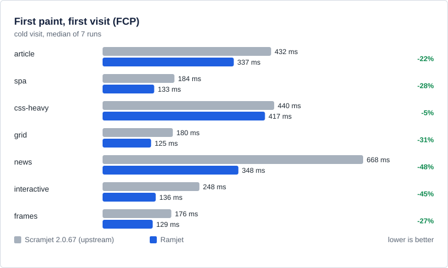
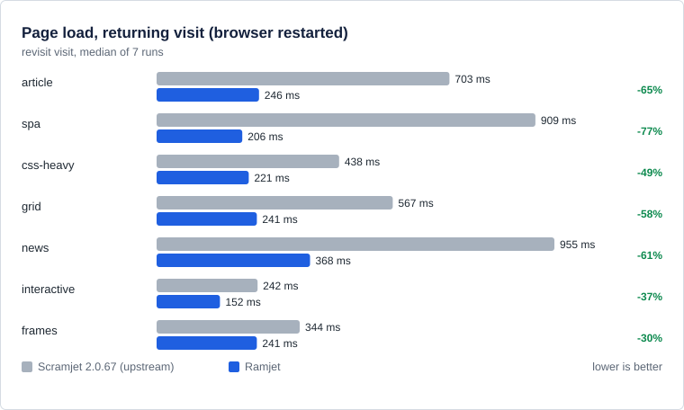
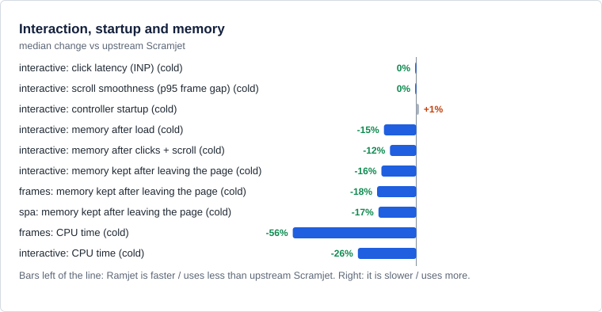

# Ramjet

**CHROMIUM BROWSERS ONLY.**

Ramjet is a performance-focused fork of [Scramjet](https://github.com/MercuryWorkshop/scramjet), with streaming HTML rewriting, persistent caching, smaller page-startup payloads and an assisted transport. Browser-side libcurl and Epoxy remain available. The assisted server handles upstream TLS, so its operator can read proxied traffic.

## Performance

In the October 3, 2026 synthetic benchmarks against Scramjet 2.0.67:

- First paint was 5–48% lower across the tested fixtures.
- Returning-visit load times were 30–77% lower.
- Post-load memory was 8–16% lower; interaction latency was unchanged.

Measured on one Windows machine with Chromium and a simulated network. These figures describe the earlier measured build. Later checks found some slower timings, including about 5 ms higher returning-visit load. [Full results and methods](docs/perf/RESULTS.md).

[AGPL-3.0-only](LICENSE). Original project attribution is in [NOTICE.md](NOTICE.md).
