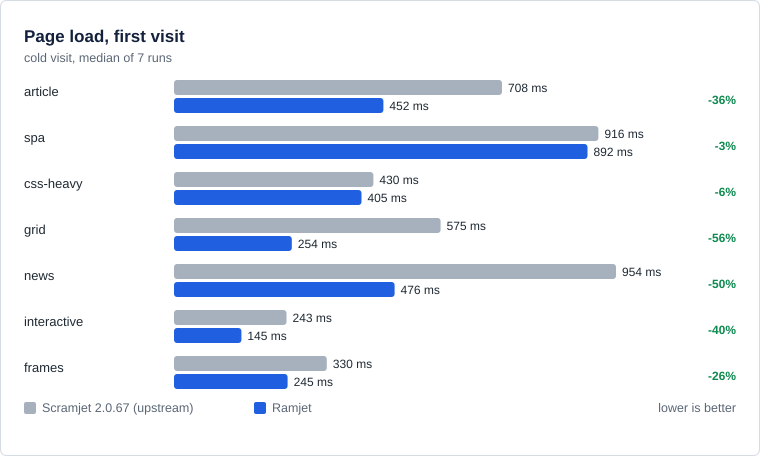
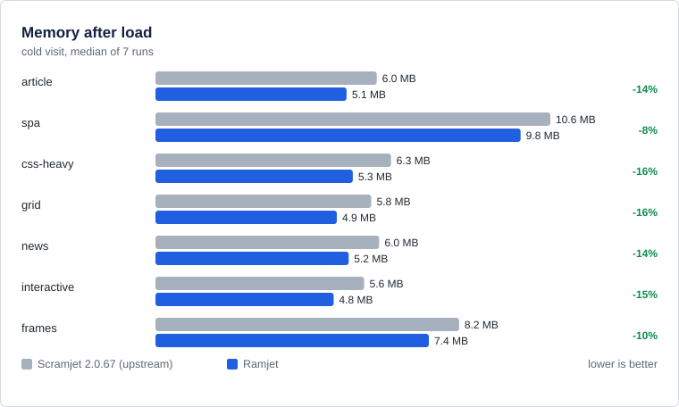
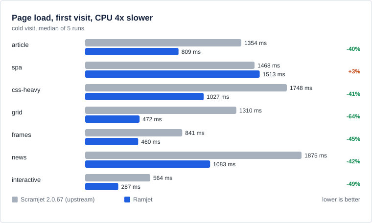

# Ramjet results (measured 2026-10-03)

Ramjet versus upstream Scramjet 2.0.67-alpha.2 (`b14b709a`, libcurl transport), Ramjet running its default **assisted transport**.
Chromium via Playwright on Windows 11, simulated origin `typical` = 80 ms RTT, 20 Mbps. Every cell is the median of N interleaved runs
(both builds measured inside the same invocation, alternating), with 95 % bootstrap intervals; `*` or "significant" means the interval of the
change excludes zero. Raw data: [`packages/bench/results/final/`](../../packages/bench/results/final/) with the build record in
[`MEASURED_BUILD.md`](../../packages/bench/results/final/MEASURED_BUILD.md). Re-run a scenario with
`bash packages/bench/final-measurements.sh headline|shared-link|cpu4|interaction|proxy-tax|post-rename`.

Modes: **cold** = first load after the controller is up; **warm** = second load in the same browser session; **revisit** = load, quit the
browser, restart on the same profile, load again (a returning user; Chrome does not keep service-worker responses in its HTTP cache, so upstream
refetches everything). Every navigation first asserts that the page works (scripts ran, images decoded, the real font loaded, worker replied,
fetch/XHR succeeded, iframes ran, `document.write` output present); a run that fails any of it is an error, not a fast result.

## 1. Headline (7 runs, all fixtures)

| fixture                             |     cold first paint |            cold load |            warm load |         revisit load |
| ----------------------------------- | -------------------: | -------------------: | -------------------: | -------------------: |
| article (100 KB doc, CSS chain)     | 432 → 337 ms (−22 %) | 708 → 452 ms (−36 %) | 614 → 227 ms (−63 %) | 703 → 246 ms (−65 %) |
| news (620 KB document)              | 668 → 348 ms (−48 %) | 954 → 476 ms (−50 %) | 595 → 356 ms (−40 %) | 955 → 368 ms (−61 %) |
| grid (80 images, 6 hosts)           | 180 → 125 ms (−31 %) | 575 → 254 ms (−56 %) | 539 → 225 ms (−58 %) | 567 → 241 ms (−58 %) |
| spa (3 MB of scripts)               | 184 → 133 ms (−28 %) |  916 → 892 ms (−3 %) |  281 → 255 ms (−9 %) | 909 → 206 ms (−77 %) |
| interactive (2,000-row list)        | 248 → 136 ms (−45 %) | 243 → 145 ms (−40 %) | 201 → 143 ms (−29 %) | 242 → 152 ms (−37 %) |
| frames (iframes, worker, fetch/XHR) | 176 → 129 ms (−27 %) | 330 → 245 ms (−26 %) | 308 → 226 ms (−27 %) | 344 → 241 ms (−30 %) |
| css-heavy (2,500 rules, web font)   |  440 → 417 ms (−5 %) |  430 → 405 ms (−6 %) | 236 → 205 ms (−13 %) | 438 → 221 ms (−49 %) |

All 28 cells are significant. Charts: [first paint](charts/cold-fcp.svg), [first-visit load](charts/cold-load.svg), [returning-visit load](charts/revisit-load.svg).

## 2. CPU, memory and startup (first visit, same runs)

| fixture     |             CPU time |      heap after load |            controller startup |
| ----------- | -------------------: | -------------------: | ----------------------------: |
| article     | 382 → 258 ms (−32 %) | 6.0 → 5.1 MB (−14 %) |             88 → 84 ms (n.s.) |
| news        | 509 → 403 ms (−21 %) | 6.0 → 5.2 MB (−14 %) |             85 → 90 ms (n.s.) |
| grid        | 399 → 180 ms (−55 %) | 5.8 → 4.9 MB (−16 %) |             87 → 85 ms (n.s.) |
| spa         |  615 → 580 ms (−6 %) | 10.6 → 9.8 MB (−8 %) |             85 → 86 ms (n.s.) |
| interactive | 167 → 124 ms (−26 %) | 5.6 → 4.8 MB (−15 %) |             86 → 80 ms (n.s.) |
| frames      | 343 → 147 ms (−57 %) | 8.2 → 7.4 MB (−10 %) | 81 → 89 ms (**+11 %**, +8 ms) |
| css-heavy   | 471 → 324 ms (−31 %) | 6.3 → 5.3 MB (−16 %) |             88 → 79 ms (n.s.) |

## 3. Interaction, startup and memory retention (10 runs, `typical`)

Clicking a button three times and scrolling a 2,000-row list while sampling frames and event timing.

| metric                                                          |           upstream |             Ramjet |                             change |
| --------------------------------------------------------------- | -----------------: | -----------------: | ---------------------------------: |
| click latency (INP, interactive)                                |              16 ms |              16 ms | none (event timing has 8 ms grain) |
| p95 frame gap while scrolling                                   |            16.7 ms |            16.7 ms |                               none |
| heap after clicks and scrolling (interactive)                   |             6.9 MB |             6.1 MB |                              −12 % |
| heap kept after the page is closed (interactive / frames / spa) | 5.3 / 4.8 / 4.8 MB | 4.4 / 4.0 / 4.0 MB |              −16 % / −18 % / −17 % |
| controller startup (3 fixtures)                                 |    86 / 85 / 84 ms |    87 / 88 / 81 ms |          +1 % / +4 % / −4 % (n.s.) |
| CPU, first visit (interactive / frames / spa)                   | 166 / 346 / 628 ms | 122 / 154 / 588 ms |               −26 % / −56 % / −6 % |

The in-page runtime (hooks, wrappers) costs the same as upstream while interacting: this is **not** where Ramjet's gains come from, and
it is not a regression either.

## 4. Slow CPU and a shared link

**CPU throttled 4x** (5 runs, cold / warm): first-visit loads

| fixture     | upstream |  Ramjet |      change |
| ----------- | -------: | ------: | ----------: |
| grid        |  1310 ms |  472 ms |       −64 % |
| interactive |   564 ms |  287 ms |       −49 % |
| frames      |   841 ms |  460 ms |       −45 % |
| news        |  1875 ms | 1083 ms |       −42 % |
| css-heavy   |  1748 ms | 1027 ms |       −41 % |
| article     |  1354 ms |  809 ms |       −40 % |
| spa         |  1468 ms | 1513 ms | +3 % (n.s.) |

**One shared 20 Mbps link for every origin** (5 runs; the per-response limit of the main runs lets six hosts exceed the profile 6-fold):
first-visit load −35 % (article), −51 % (news), −54 % (grid), −32 % (frames), −37 % (interactive), −2 % `spa` and −3 % css-heavy (both n.s.);
first paint −20 % to −49 % on the six fixtures where it is significant (css-heavy −3 %, n.s.). No regression on any gated metric.

## 5. What Ramjet still costs compared with no proxy at all (7 runs)

The same fixtures loaded directly (`--dist current+native`) versus through Ramjet. `css-heavy` is excluded: its font check fails natively
(a fixture limitation).

| fixture     |          first paint |            cold load |          CPU |          heap |
| ----------- | -------------------: | -------------------: | -----------: | ------------: |
| article     | 312 → 348 ms (+12 %) | 755 → 472 ms (−37 %) | 122 → 267 ms |  1.5 → 5.3 MB |
| news        |  324 → 344 ms (+6 %) | 739 → 474 ms (−36 %) | 171 → 409 ms |  1.5 → 5.4 MB |
| grid        | 108 → 128 ms (+19 %) | 374 → 261 ms (−30 %) | 106 → 189 ms |  1.5 → 5.1 MB |
| interactive | 120 → 137 ms (+14 %) |  138 → 149 ms (+7 %) |  43 → 127 ms |  1.5 → 5.0 MB |
| frames      | 108 → 132 ms (+22 %) | 190 → 244 ms (+29 %) |  44 → 157 ms |  2.2 → 7.6 MB |
| spa         | 108 → 137 ms (+26 %) | 785 → 901 ms (+15 %) | 159 → 603 ms | 6.2 → 10.1 MB |

Click latency and scroll smoothness are identical to native (16 ms, 17 ms). The fixed tax is **17–36 ms of first paint and ~3.5–4 MB of heap
per page**. Profiles show where the main thread goes: about 31 ms in the runtime script (parse, compile, hooks), ~12 ms of wasm, ~6 ms of libcurl/RPC
on a fast page; 84 ms of wasm rewriting on `spa`. With long-lived caching headers on the runtime files (so Chrome keeps their compiled code) warm CPU
dropped 8–24 % and warm load 2–12 % (`code-cache` scenario, 8 runs): a deployment recipe, not a code change.

## 6. What produced the gains (largest first)

1. **Persistent output cache**: a returning visit is answered by the service worker, −30 % to −77 % load.
2. **Streaming HTML**: large documents start painting while they download (news −48 % first paint); the head is flushed after the first
   chunk when the charset is declared.
3. **Assisted transport**: server-side TLS/HTTP-2/DNS with pooling, native decompression: many-resource pages load 36–64 % faster (grid −56 %, −64 % at CPU 4x), CPU −21 to −57 %.
4. **Shared compiled wasm, raw-binary workers, per-host cookie bootstrap**: no 780 KB base64 script, no per-document compile; `frames` CPU −34 %
   cold and heap −9 % on top of the earlier build.
5. Smaller: speed-tuned wasm build, URL-rewrite memo, handler trims.

## 7. Regressions and what they mean

| where                                          | change                    | assessment                                                                                                       |
| ---------------------------------------------- | ------------------------- | ---------------------------------------------------------------------------------------------------------------- |
| controller startup, `frames` cold              | 81 → 89 ms (+8 ms, +11 %) | real but small; the assisted WebSocket handshake and wasm sharing add to startup; not seen on the other 20 cells |
| controller startup, `news` revisit             | 74 → 78 ms (+4 ms, +5 %)  | same                                                                                                             |
| per-resource p50 latency, `article` cold       | 123 → 130 ms (+5 %)       | excused by the rule: first paint and load both improved significantly                                            |
| per-resource p95 latency, `spa` cold at CPU 4x | 985 → 1039 ms (+5.4 %)    | the 3 MB script; `spa` load itself is unchanged (n.s.)                                                           |

Nothing else regressed on any gated metric (first paint, LCP, load, per-resource latency, heap, startup, click latency, scroll smoothness, memory kept).

## 8. Verification

| suite                                                    | result                                                                                                                                       |
| -------------------------------------------------------- | -------------------------------------------------------------------------------------------------------------------------------------------- |
| runway, libcurl transport                                | 520 passed / 142 failed / 6 errors = the frozen upstream baseline (148 known failures in `packages/runway/failing_tests.json`), 0 unexpected |
| runway over the assisted transport                       | 521 / 141 / 6, 0 unexpected (`websocketstream-sanity` also passes)                                                                           |
| core unit                                                | 111                                                                                                                                          |
| controller unit                                          | 31                                                                                                                                           |
| assisted server + client                                 | 31 + 5                                                                                                                                       |
| bootstrap, create-ramjet-app, bench                      | 5, 4, 12                                                                                                                                     |
| cache integration (`packages/bench/src/verify-cache.ts`) | origin requests on revisit 1 instead of 4; stale entries revalidated with a 304 on the assisted transport; none attempted on libcurl         |

The same unit and runway results hold after each of the three rename stages (see section 9).

## 9. After the Scramjet → Ramjet rename

The rename was done in three tested stages (docs/RENAME.md). After the last one the renamed build was measured against the snapshot of the build
that produced sections 1–7 (`results/final/post-rename`, 7 runs, all fixtures, cold / warm / revisit, assisted transport, same harness and same
invocation, interleaved):

| fixture     |    cold first paint |    cold load |           warm load |        revisit load |          CPU |           heap |             startup |
| ----------- | ------------------: | -----------: | ------------------: | ------------------: | -----------: | -------------: | ------------------: |
| article     |        345 → 345 ms | 490 → 488 ms |        237 → 237 ms |        255 → 248 ms | 382 → 370 ms |   5.3 → 5.3 MB |        134 → 119 ms |
| spa         |        145 → 144 ms | 934 → 912 ms |        267 → 269 ms |        219 → 222 ms | 756 → 693 ms | 10.1 → 10.1 MB |        131 → 119 ms |
| css-heavy   | 428 → 445 ms (+4 %) | 417 → 425 ms |        201 → 199 ms |        210 → 199 ms | 478 → 490 ms |   5.5 → 5.5 MB |        130 → 116 ms |
| grid        |        133 → 132 ms | 292 → 292 ms | 234 → 243 ms (+4 %) |        242 → 244 ms | 274 → 264 ms |   5.1 → 5.1 MB |        119 → 119 ms |
| frames      |        149 → 144 ms | 256 → 257 ms |        230 → 227 ms |        246 → 239 ms | 201 → 199 ms |   7.6 → 7.6 MB |        125 → 114 ms |
| news        |        361 → 368 ms | 512 → 521 ms |        366 → 366 ms |        374 → 369 ms | 548 → 548 ms |   5.4 → 5.4 MB |        125 → 124 ms |
| interactive |        165 → 161 ms | 166 → 166 ms |        179 → 177 ms | 151 → 157 ms (+4 %) | 161 → 160 ms |   5.0 → 5.0 MB | 123 → 132 ms (+7 %) |

Most tabulated timings stayed within ±5%; heap was identical to the tenth of a megabyte. The gate flagged one pair,
`interactive` returning-visit first paint / LCP +5.8 % (+8 ms, interval 0.0 to 9.0 %), while that fixture's load differs by +4 % (not significant)
and its other 20 cells do not move; The interval touches zero, so the cause is uncertain; the increase remains in the record. (Absolute startup is higher here than in
section 2 because the harness now loads the runtime scripts dynamically so that one harness can serve both builds; both sides pay it equally.)

Unit tests and runway after each stage: build, typecheck (no new errors against the stage-1 baseline), core 111, controller 31, assisted-server 31,
transport 5, bootstrap 5, create-ramjet-app 4, bench 12, runway 520 / 142 / 6 on libcurl and 521 / 141 / 6 on the assisted transport, 0 unexpected,
at stage 1, stage 2 and stage 3.

## 10. Next optimization, from the profiles

The profiles say what **not** to build: main-thread JavaScript rewriting is 84 ms of `spa`'s ~890 ms and ~10 ms elsewhere, so a rewrite
worker pool has no evidence behind it; in-page interaction cost equals upstream, so more Rust in the client path has none either. What remains is
the fixed per-document cost versus no proxy (17–36 ms first paint, ~80–280 ms CPU, ~3.5–4 MB heap), dominated by the ~243 KB runtime script
(parse/compile/hook install) and the per-frame wasm instance. The next worthwhile step is **reducing the runtime's boot work**: lazy-install the
rarely used hook modules (split `ramjet.js`), measure with the long-lived-cache setup so Chrome's code cache is in play, and gate it on `startupMs`,
first paint and the runway suite. Cheap and already measured: serve the runtime files with immutable caching headers in deployments.

## 11. Limits and not done

- One machine, Windows 11, Chromium only; simulated network; synthetic fixtures (including real vendor script samples), not live sites.
- The main runs use cleartext origins, so the assisted transport's TLS handshake savings are not in the tables; TLS + HTTP/2 was measured separately
  only for preconnect (below).
- Preconnect from page hints is **opt-in**: over TLS + HTTP/2 with cold pools it gave `news` −1.6 % first paint / −2.6 % load and `grid` +1.3 %
  first paint (n.s.), `article` neutral (15 runs for `grid`). Prefetch stays off.
- Event timing has 8 ms granularity; startup is ~85 ms with ±10 ms noise per run.
- Not done: Rust port of the assisted server (the Node one is a reference), rate limiting in it, a core worker (low value measured), per-header
  `Vary` keying, boot-payload splitting (section 10).
- Bug found and fixed on the way (kept in the record): a pre-opened socket handed to the HTTP client synchronously made HTTP/1.1 requests hang
  (cold loads of 90–180 s at CPU 4x); the runs it invalidated are kept under `results/final/superseded-*`.

## 12. Check after the compatibility patches (2026-10-04)

After the empty-POST `Content-Length` fix and the injected `Accept-Language` / client hints, the previously measured build was compared with the
current build (assisted transport, typical profile, 7 interleaved runs, cold/warm/revisit, cleartext origins; raw data and per-fixture table in
`packages/bench/results/final/post-compat-patches/`). Mean of the per-fixture median differences: cold first paint +0.3 ms, cold load +1.9 ms,
warm first paint -0.9 ms, warm load -0.7 ms, **revisit first paint +4.3 ms, revisit load +5.1 ms**. Cold and warm are inside the noise (first paint has
4-8 ms granularity). The revisit increase is small but consistent in sign; not yet attributed (it may come from the extra request headers on
validation requests, or from noise; `css-heavy` revisit load +21 ms is a bimodal fixture). One of 56 measurements (current build, `news`, run 7) failed on
a temp-directory cleanup `EPERM` and is excluded (that cell has 6 runs). No new speedup is claimed; the headline numbers above still describe the earlier build.
